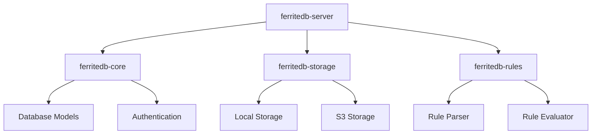

# FerriteDB Developer Guide

This comprehensive guide covers everything developers need to know to work with, extend, and contribute to FerriteDB.

## Table of Contents

- [Getting Started](#getting-started)
- [Development Environment](#development-environment)
- [Project Structure](#project-structure)
- [Building and Testing](#building-and-testing)
- [Core Concepts](#core-concepts)
- [API Development](#api-development)
- [Database Layer](#database-layer)
- [Authentication System](#authentication-system)
- [Rules Engine](#rules-engine)
- [File Storage](#file-storage)
- [Real-time Features](#real-time-features)
- [Testing Strategy](#testing-strategy)
- [Performance Optimization](#performance-optimization)
- [Contributing Guidelines](#contributing-guidelines)
- [Debugging and Troubleshooting](#debugging-and-troubleshooting)

## Getting Started

### Prerequisites

- **Rust**: 1.75.0 or later
- **Git**: For version control
- **Docker**: For containerized development (optional)
- **PostgreSQL**: For database development (optional)

### Quick Setup

```bash
# Clone the repository
git clone https://github.com/foozio/ferritedb.git
cd ferritedb

# Install Rust dependencies
cargo build

# Run tests
cargo test

# Start development server
cargo run -- serve --config ferritedb.dev.toml
```

## Development Environment

### Recommended Tools

#### Code Editor
- **VS Code** with Rust extensions:
  - rust-analyzer
  - CodeLLDB (for debugging)
  - Better TOML
  - Error Lens

#### CLI Tools
```bash
# Install useful Rust tools
cargo install cargo-watch    # Auto-rebuild on changes
cargo install cargo-expand   # Macro expansion
cargo install cargo-audit    # Security audit
cargo install sqlx-cli       # Database migrations
```

### Environment Configuration

Create a development configuration file:

```toml
# ferritedb.dev.toml
[server]
host = "127.0.0.1"
port = 8090
cors_origins = ["http://localhost:3000", "http://localhost:8080"]

[database]
url = "sqlite:data/dev.db"
auto_migrate = true

[auth]
jwt_secret = "dev-secret-change-in-production"
token_ttl = 3600

[storage]
backend = "Local"
[storage.local]
path = "data/dev-files"

[features]
admin_ui = true
metrics = true
audit_logging = true

[logging]
level = "debug"
```

### Development Workflow

```bash
# Watch mode for development
cargo watch -x 'run -- serve --config ferritedb.dev.toml'

# Run specific tests
cargo test auth::tests

# Check code formatting
cargo fmt --check

# Run linter
cargo clippy -- -D warnings

# Generate documentation
cargo doc --open
```

## Project Structure

```
ferritedb/
├── crates/                 # Rust workspace crates
│   ├── core/              # Core business logic
│   │   ├── src/
│   │   │   ├── auth/      # Authentication system
│   │   │   ├── collections/ # Dynamic collections
│   │   │   ├── models/    # Data models
│   │   │   └── lib.rs
│   │   └── Cargo.toml
│   ├── server/            # HTTP server and API
│   │   ├── src/
│   │   │   ├── handlers/  # Request handlers
│   │   │   ├── middleware/ # HTTP middleware
│   │   │   ├── realtime/  # WebSocket handling
│   │   │   └── lib.rs
│   │   └── Cargo.toml
│   ├── storage/           # File storage backends
│   │   ├── src/
│   │   │   ├── local/     # Local filesystem
│   │   │   ├── s3/        # S3-compatible storage
│   │   │   └── lib.rs
│   │   └── Cargo.toml
│   ├── rules/             # Rules engine
│   │   ├── src/
│   │   │   ├── parser/    # Rule expression parser
│   │   │   ├── evaluator/ # Rule evaluation
│   │   │   └── lib.rs
│   │   └── Cargo.toml
│   └── sdk-rs/            # Rust SDK
│       ├── src/
│       │   ├── client/    # HTTP client
│       │   ├── models/    # Shared models
│       │   └── lib.rs
│       └── Cargo.toml
├── src/                   # Main binary
│   └── main.rs
├── tests/                 # Integration tests
├── migrations/            # Database migrations
├── docs/                  # Documentation
├── scripts/               # Build and utility scripts
└── Cargo.toml            # Workspace configuration
```

### Crate Dependencies



## Building and Testing

### Build Commands

```bash
# Debug build
cargo build

# Release build
cargo build --release

# Build specific crate
cargo build -p ferritedb-core

# Build with all features
cargo build --all-features

# Cross-compilation
cargo build --target x86_64-unknown-linux-musl
```

### Testing

```bash
# Run all tests
cargo test

# Run tests with output
cargo test -- --nocapture

# Run specific test module
cargo test auth::tests::test_login

# Run integration tests
cargo test --test integration

# Run tests with coverage
cargo tarpaulin --out Html
```

### Database Migrations

```bash
# Create new migration
sqlx migrate add create_users_table

# Run migrations
sqlx migrate run --database-url sqlite:data/dev.db

# Revert last migration
sqlx migrate revert --database-url sqlite:data/dev.db
```

## Core Concepts

### Request Lifecycle

```rust
// Example request flow
async fn handle_request(
    State(app_state): State<AppState>,
    headers: HeaderMap,
    Json(payload): Json<CreateRecordRequest>,
) -> Result<Json<Record>, ApiError> {
    // 1. Authentication
    let user = authenticate_request(&headers, &app_state.auth).await?;
    
    // 2. Authorization
    authorize_collection_access(&user, &payload.collection, "create").await?;
    
    // 3. Validation
    let validated_data = validate_record_data(&payload.data)?;
    
    // 4. Business Logic
    let record = app_state.collections
        .create_record(&payload.collection, validated_data, &user)
        .await?;
    
    // 5. Response
    Ok(Json(record))
}
```

### Error Handling

```rust
use thiserror::Error;

#[derive(Error, Debug)]
pub enum ApiError {
    #[error("Authentication failed: {0}")]
    AuthenticationFailed(String),
    
    #[error("Authorization failed: {0}")]
    AuthorizationFailed(String),
    
    #[error("Validation error: {field}")]
    ValidationError { field: String },
    
    #[error("Database error: {0}")]
    DatabaseError(#[from] sqlx::Error),
    
    #[error("Internal server error")]
    InternalError,
}

impl IntoResponse for ApiError {
    fn into_response(self) -> Response {
        let (status, error_message) = match self {
            ApiError::AuthenticationFailed(_) => (StatusCode::UNAUTHORIZED, self.to_string()),
            ApiError::AuthorizationFailed(_) => (StatusCode::FORBIDDEN, self.to_string()),
            ApiError::ValidationError { .. } => (StatusCode::BAD_REQUEST, self.to_string()),
            ApiError::DatabaseError(_) => (StatusCode::INTERNAL_SERVER_ERROR, "Database error".to_string()),
            ApiError::InternalError => (StatusCode::INTERNAL_SERVER_ERROR, "Internal server error".to_string()),
        };

        let body = Json(json!({
            "error": {
                "message": error_message,
                "code": status.as_u16()
            }
        }));

        (status, body).into_response()
    }
}
```

## API Development

### Creating New Endpoints

1. **Define the handler function**:

```rust
// crates/server/src/handlers/collections.rs
pub async fn create_collection(
    State(state): State<AppState>,
    headers: HeaderMap,
    Json(request): Json<CreateCollectionRequest>,
) -> Result<Json<Collection>, ApiError> {
    let user = authenticate_request(&headers, &state.auth).await?;
    
    // Only admins can create collections
    if user.role != UserRole::Admin {
        return Err(ApiError::AuthorizationFailed("Admin role required".to_string()));
    }
    
    let collection = state.collections.create(request, &user).await?;
    Ok(Json(collection))
}
```

2. **Add route to router**:

```rust
// crates/server/src/routes.rs
pub fn create_router(state: AppState) -> Router {
    Router::new()
        .route("/api/collections", post(handlers::collections::create_collection))
        .route("/api/collections", get(handlers::collections::list_collections))
        .route("/api/collections/:name", get(handlers::collections::get_collection))
        .with_state(state)
}
```

3. **Add request/response models**:

```rust
// crates/core/src/models/requests.rs
#[derive(Debug, Deserialize, Validate)]
pub struct CreateCollectionRequest {
    #[validate(length(min = 1, max = 50))]
    pub name: String,
    
    pub schema: CollectionSchema,
    
    #[serde(default)]
    pub rules: CollectionRules,
}
```

### Middleware Development

```rust
// crates/server/src/middleware/auth.rs
pub async fn auth_middleware(
    State(state): State<AppState>,
    mut request: Request,
    next: Next,
) -> Result<Response, StatusCode> {
    let auth_header = request
        .headers()
        .get(AUTHORIZATION)
        .and_then(|header| header.to_str().ok());

    if let Some(auth_header) = auth_header {
        if let Some(token) = auth_header.strip_prefix("Bearer ") {
            match state.auth.validate_token(token).await {
                Ok(user) => {
                    request.extensions_mut().insert(user);
                    return Ok(next.run(request).await);
                }
                Err(_) => return Err(StatusCode::UNAUTHORIZED),
            }
        }
    }

    Err(StatusCode::UNAUTHORIZED)
}
```

## Database Layer

### Model Definition

```rust
// crates/core/src/models/user.rs
use sqlx::FromRow;
use serde::{Deserialize, Serialize};
use uuid::Uuid;
use chrono::{DateTime, Utc};

#[derive(Debug, Clone, Serialize, Deserialize, FromRow)]
pub struct User {
    pub id: Uuid,
    pub email: String,
    pub password_hash: String,
    pub role: UserRole,
    pub verified: bool,
    pub created_at: DateTime<Utc>,
    pub updated_at: DateTime<Utc>,
}

#[derive(Debug, Clone, Serialize, Deserialize, sqlx::Type)]
#[sqlx(type_name = "user_role", rename_all = "lowercase")]
pub enum UserRole {
    Admin,
    User,
    Service,
}
```

### Repository Pattern

```rust
// crates/core/src/repositories/user.rs
use async_trait::async_trait;
use sqlx::{Database, Pool};
use uuid::Uuid;

#[async_trait]
pub trait UserRepository: Send + Sync {
    async fn create(&self, user: CreateUserRequest) -> Result<User, RepositoryError>;
    async fn find_by_id(&self, id: Uuid) -> Result<Option<User>, RepositoryError>;
    async fn find_by_email(&self, email: &str) -> Result<Option<User>, RepositoryError>;
    async fn update(&self, id: Uuid, updates: UpdateUserRequest) -> Result<User, RepositoryError>;
    async fn delete(&self, id: Uuid) -> Result<(), RepositoryError>;
}

pub struct SqlUserRepository<DB: Database> {
    pool: Pool<DB>,
}

#[async_trait]
impl UserRepository for SqlUserRepository<sqlx::Sqlite> {
    async fn create(&self, request: CreateUserRequest) -> Result<User, RepositoryError> {
        let user = sqlx::query_as!(
            User,
            r#"
            INSERT INTO users (id, email, password_hash, role, verified)
            VALUES (?, ?, ?, ?, ?)
            RETURNING *
            "#,
            request.id,
            request.email,
            request.password_hash,
            request.role as UserRole,
            request.verified
        )
        .fetch_one(&self.pool)
        .await?;

        Ok(user)
    }

    async fn find_by_email(&self, email: &str) -> Result<Option<User>, RepositoryError> {
        let user = sqlx::query_as!(
            User,
            "SELECT * FROM users WHERE email = ?",
            email
        )
        .fetch_optional(&self.pool)
        .await?;

        Ok(user)
    }
}
```

### Database Migrations

```sql
-- migrations/001_create_users_table.sql
CREATE TABLE users (
    id TEXT PRIMARY KEY,
    email TEXT UNIQUE NOT NULL,
    password_hash TEXT NOT NULL,
    role TEXT NOT NULL DEFAULT 'user',
    verified BOOLEAN NOT NULL DEFAULT FALSE,
    created_at DATETIME NOT NULL DEFAULT CURRENT_TIMESTAMP,
    updated_at DATETIME NOT NULL DEFAULT CURRENT_TIMESTAMP
);

CREATE INDEX idx_users_email ON users(email);
CREATE INDEX idx_users_role ON users(role);
```

## Authentication System

### JWT Token Management

```rust
// crates/core/src/auth/jwt.rs
use jsonwebtoken::{decode, encode, DecodingKey, EncodingKey, Header, Validation};
use serde::{Deserialize, Serialize};
use uuid::Uuid;

#[derive(Debug, Serialize, Deserialize)]
pub struct Claims {
    pub sub: Uuid,      // User ID
    pub email: String,
    pub role: UserRole,
    pub exp: usize,     // Expiration time
    pub iat: usize,     // Issued at
}

pub struct JwtManager {
    encoding_key: EncodingKey,
    decoding_key: DecodingKey,
    validation: Validation,
}

impl JwtManager {
    pub fn new(secret: &str) -> Self {
        Self {
            encoding_key: EncodingKey::from_secret(secret.as_ref()),
            decoding_key: DecodingKey::from_secret(secret.as_ref()),
            validation: Validation::default(),
        }
    }

    pub fn generate_token(&self, user: &User, ttl: u64) -> Result<String, AuthError> {
        let now = chrono::Utc::now().timestamp() as usize;
        let claims = Claims {
            sub: user.id,
            email: user.email.clone(),
            role: user.role.clone(),
            exp: now + ttl as usize,
            iat: now,
        };

        encode(&Header::default(), &claims, &self.encoding_key)
            .map_err(|e| AuthError::TokenGeneration(e.to_string()))
    }

    pub fn validate_token(&self, token: &str) -> Result<Claims, AuthError> {
        decode::<Claims>(token, &self.decoding_key, &self.validation)
            .map(|data| data.claims)
            .map_err(|e| AuthError::TokenValidation(e.to_string()))
    }
}
```

### Password Hashing

```rust
// crates/core/src/auth/password.rs
use argon2::{Argon2, PasswordHash, PasswordHasher, PasswordVerifier};
use argon2::password_hash::{rand_core::OsRng, SaltString};

pub struct PasswordManager {
    argon2: Argon2<'static>,
}

impl PasswordManager {
    pub fn new() -> Self {
        Self {
            argon2: Argon2::default(),
        }
    }

    pub fn hash_password(&self, password: &str) -> Result<String, AuthError> {
        let salt = SaltString::generate(&mut OsRng);
        let password_hash = self.argon2
            .hash_password(password.as_bytes(), &salt)
            .map_err(|e| AuthError::PasswordHashing(e.to_string()))?;
        
        Ok(password_hash.to_string())
    }

    pub fn verify_password(&self, password: &str, hash: &str) -> Result<bool, AuthError> {
        let parsed_hash = PasswordHash::new(hash)
            .map_err(|e| AuthError::PasswordVerification(e.to_string()))?;
        
        match self.argon2.verify_password(password.as_bytes(), &parsed_hash) {
            Ok(()) => Ok(true),
            Err(_) => Ok(false),
        }
    }
}
```

## Rules Engine

### Rule Expression Parser

```rust
// crates/rules/src/parser.rs
use pest::Parser;
use pest_derive::Parser;

#[derive(Parser)]
#[grammar = "rules.pest"]
pub struct RuleParser;

#[derive(Debug, Clone)]
pub enum Expression {
    Binary {
        left: Box<Expression>,
        operator: BinaryOperator,
        right: Box<Expression>,
    },
    Unary {
        operator: UnaryOperator,
        operand: Box<Expression>,
    },
    Field {
        object: String,
        field: String,
    },
    Literal(Value),
}

#[derive(Debug, Clone)]
pub enum BinaryOperator {
    Equal,
    NotEqual,
    GreaterThan,
    LessThan,
    And,
    Or,
}

pub fn parse_rule(input: &str) -> Result<Expression, ParseError> {
    let pairs = RuleParser::parse(Rule::expression, input)?;
    // Parse implementation...
}
```

### Rule Evaluation

```rust
// crates/rules/src/evaluator.rs
use std::collections::HashMap;
use serde_json::Value;

pub struct RuleEvaluator {
    context: HashMap<String, Value>,
}

impl RuleEvaluator {
    pub fn new() -> Self {
        Self {
            context: HashMap::new(),
        }
    }

    pub fn with_user(&mut self, user: &User) -> &mut Self {
        self.context.insert("user".to_string(), json!({
            "id": user.id,
            "email": user.email,
            "role": user.role,
        }));
        self
    }

    pub fn with_record(&mut self, record: &Value) -> &mut Self {
        self.context.insert("record".to_string(), record.clone());
        self
    }

    pub fn evaluate(&self, expression: &Expression) -> Result<bool, EvaluationError> {
        match expression {
            Expression::Binary { left, operator, right } => {
                let left_val = self.evaluate_value(left)?;
                let right_val = self.evaluate_value(right)?;
                self.evaluate_binary_op(&left_val, operator, &right_val)
            }
            Expression::Field { object, field } => {
                let value = self.get_field_value(object, field)?;
                Ok(value.as_bool().unwrap_or(false))
            }
            Expression::Literal(value) => {
                Ok(value.as_bool().unwrap_or(false))
            }
        }
    }
}
```

## File Storage

### Storage Backend Trait

```rust
// crates/storage/src/backend.rs
use async_trait::async_trait;
use bytes::Bytes;
use std::path::Path;

#[async_trait]
pub trait StorageBackend: Send + Sync {
    async fn store(&self, path: &str, data: Bytes) -> Result<StorageMetadata, StorageError>;
    async fn retrieve(&self, path: &str) -> Result<Bytes, StorageError>;
    async fn delete(&self, path: &str) -> Result<(), StorageError>;
    async fn exists(&self, path: &str) -> Result<bool, StorageError>;
    async fn metadata(&self, path: &str) -> Result<StorageMetadata, StorageError>;
}

#[derive(Debug, Clone)]
pub struct StorageMetadata {
    pub size: u64,
    pub content_type: Option<String>,
    pub etag: Option<String>,
    pub last_modified: Option<chrono::DateTime<chrono::Utc>>,
}
```

### Local Storage Implementation

```rust
// crates/storage/src/local.rs
use std::path::PathBuf;
use tokio::fs;

pub struct LocalStorage {
    base_path: PathBuf,
}

#[async_trait]
impl StorageBackend for LocalStorage {
    async fn store(&self, path: &str, data: Bytes) -> Result<StorageMetadata, StorageError> {
        let full_path = self.base_path.join(path);
        
        // Create parent directories
        if let Some(parent) = full_path.parent() {
            fs::create_dir_all(parent).await?;
        }
        
        // Write file
        fs::write(&full_path, &data).await?;
        
        // Get metadata
        let metadata = fs::metadata(&full_path).await?;
        
        Ok(StorageMetadata {
            size: metadata.len(),
            content_type: None,
            etag: None,
            last_modified: metadata.modified().ok()
                .map(|t| chrono::DateTime::from(t)),
        })
    }

    async fn retrieve(&self, path: &str) -> Result<Bytes, StorageError> {
        let full_path = self.base_path.join(path);
        let data = fs::read(&full_path).await?;
        Ok(Bytes::from(data))
    }
}
```

## Real-time Features

### WebSocket Handler

```rust
// crates/server/src/realtime/websocket.rs
use axum::extract::ws::{Message, WebSocket};
use futures_util::{SinkExt, StreamExt};
use tokio::sync::broadcast;

pub async fn websocket_handler(
    ws: WebSocket,
    state: AppState,
) {
    let (mut sender, mut receiver) = ws.split();
    let mut rx = state.realtime.subscribe();

    // Handle incoming messages
    let mut recv_task = tokio::spawn(async move {
        while let Some(Ok(msg)) = receiver.next().await {
            if let Message::Text(text) = msg {
                if let Ok(request) = serde_json::from_str::<RealtimeRequest>(&text) {
                    handle_realtime_request(request, &state).await;
                }
            }
        }
    });

    // Handle outgoing messages
    let mut send_task = tokio::spawn(async move {
        while let Ok(event) = rx.recv().await {
            let message = serde_json::to_string(&event).unwrap();
            if sender.send(Message::Text(message)).await.is_err() {
                break;
            }
        }
    });

    // Wait for either task to finish
    tokio::select! {
        _ = (&mut send_task) => {
            recv_task.abort();
        },
        _ = (&mut recv_task) => {
            send_task.abort();
        }
    }
}
```

### Event Broadcasting

```rust
// crates/server/src/realtime/events.rs
use tokio::sync::broadcast;
use serde::{Deserialize, Serialize};

#[derive(Debug, Clone, Serialize, Deserialize)]
pub enum RealtimeEvent {
    RecordCreated {
        collection: String,
        record: serde_json::Value,
    },
    RecordUpdated {
        collection: String,
        record: serde_json::Value,
    },
    RecordDeleted {
        collection: String,
        record_id: String,
    },
}

pub struct RealtimeManager {
    sender: broadcast::Sender<RealtimeEvent>,
}

impl RealtimeManager {
    pub fn new() -> Self {
        let (sender, _) = broadcast::channel(1000);
        Self { sender }
    }

    pub fn subscribe(&self) -> broadcast::Receiver<RealtimeEvent> {
        self.sender.subscribe()
    }

    pub fn broadcast(&self, event: RealtimeEvent) -> Result<(), broadcast::error::SendError<RealtimeEvent>> {
        self.sender.send(event).map(|_| ())
    }
}
```

## Testing Strategy

### Unit Tests

```rust
// crates/core/src/auth/tests.rs
#[cfg(test)]
mod tests {
    use super::*;

    #[tokio::test]
    async fn test_password_hashing() {
        let manager = PasswordManager::new();
        let password = "test_password_123";
        
        let hash = manager.hash_password(password).unwrap();
        assert!(manager.verify_password(password, &hash).unwrap());
        assert!(!manager.verify_password("wrong_password", &hash).unwrap());
    }

    #[tokio::test]
    async fn test_jwt_token_generation() {
        let manager = JwtManager::new("test_secret");
        let user = User {
            id: Uuid::new_v4(),
            email: "test@example.com".to_string(),
            role: UserRole::User,
            // ... other fields
        };

        let token = manager.generate_token(&user, 3600).unwrap();
        let claims = manager.validate_token(&token).unwrap();
        
        assert_eq!(claims.sub, user.id);
        assert_eq!(claims.email, user.email);
    }
}
```

### Integration Tests

```rust
// tests/integration/auth.rs
use ferritedb_server::create_app;
use axum_test::TestServer;

#[tokio::test]
async fn test_user_registration_and_login() {
    let app = create_app().await;
    let server = TestServer::new(app).unwrap();

    // Register user
    let response = server
        .post("/api/auth/register")
        .json(&json!({
            "email": "test@example.com",
            "password": "secure_password_123",
            "password_confirm": "secure_password_123"
        }))
        .await;

    assert_eq!(response.status_code(), 201);

    // Login
    let response = server
        .post("/api/auth/login")
        .json(&json!({
            "email": "test@example.com",
            "password": "secure_password_123"
        }))
        .await;

    assert_eq!(response.status_code(), 200);
    let body: serde_json::Value = response.json();
    assert!(body["token"].is_string());
}
```

### Performance Tests

```rust
// tests/performance/load_test.rs
use criterion::{black_box, criterion_group, criterion_main, Criterion};

fn benchmark_password_hashing(c: &mut Criterion) {
    let manager = PasswordManager::new();
    
    c.bench_function("password_hashing", |b| {
        b.iter(|| {
            manager.hash_password(black_box("test_password_123"))
        })
    });
}

criterion_group!(benches, benchmark_password_hashing);
criterion_main!(benches);
```

## Performance Optimization

### Database Query Optimization

```rust
// Efficient batch operations
pub async fn create_multiple_records(
    &self,
    collection: &str,
    records: Vec<CreateRecordRequest>,
) -> Result<Vec<Record>, RepositoryError> {
    let mut tx = self.pool.begin().await?;
    let mut created_records = Vec::new();

    for record in records {
        let created = sqlx::query_as!(
            Record,
            "INSERT INTO records (collection, data) VALUES (?, ?) RETURNING *",
            collection,
            serde_json::to_string(&record.data)?
        )
        .fetch_one(&mut *tx)
        .await?;
        
        created_records.push(created);
    }

    tx.commit().await?;
    Ok(created_records)
}
```

### Caching Implementation

```rust
// crates/core/src/cache.rs
use std::collections::HashMap;
use std::sync::Arc;
use tokio::sync::RwLock;
use std::time::{Duration, Instant};

pub struct Cache<K, V> {
    data: Arc<RwLock<HashMap<K, CacheEntry<V>>>>,
    ttl: Duration,
}

struct CacheEntry<V> {
    value: V,
    expires_at: Instant,
}

impl<K, V> Cache<K, V>
where
    K: std::hash::Hash + Eq + Clone,
    V: Clone,
{
    pub fn new(ttl: Duration) -> Self {
        Self {
            data: Arc::new(RwLock::new(HashMap::new())),
            ttl,
        }
    }

    pub async fn get(&self, key: &K) -> Option<V> {
        let data = self.data.read().await;
        if let Some(entry) = data.get(key) {
            if entry.expires_at > Instant::now() {
                return Some(entry.value.clone());
            }
        }
        None
    }

    pub async fn set(&self, key: K, value: V) {
        let mut data = self.data.write().await;
        data.insert(key, CacheEntry {
            value,
            expires_at: Instant::now() + self.ttl,
        });
    }
}
```

## Contributing Guidelines

### Code Style

```rust
// Use consistent naming conventions
pub struct UserRepository;  // PascalCase for types
pub fn create_user();       // snake_case for functions
pub const MAX_USERS: u32;   // SCREAMING_SNAKE_CASE for constants

// Prefer explicit error handling
pub fn risky_operation() -> Result<String, MyError> {
    // Implementation
}

// Use meaningful variable names
let user_repository = UserRepository::new();
let authenticated_user = authenticate_request(&headers)?;

// Document public APIs
/// Creates a new user with the provided email and password.
/// 
/// # Arguments
/// 
/// * `email` - A valid email address
/// * `password` - A password meeting security requirements
/// 
/// # Returns
/// 
/// Returns the created user on success, or an error if creation fails.
pub async fn create_user(email: String, password: String) -> Result<User, AuthError> {
    // Implementation
}
```

### Commit Guidelines

```bash
# Use conventional commits
git commit -m "feat: add user authentication system"
git commit -m "fix: resolve database connection timeout"
git commit -m "docs: update API documentation"
git commit -m "test: add integration tests for collections"
git commit -m "refactor: improve error handling in auth module"
```

### Pull Request Process

1. **Fork and Branch**: Create a feature branch from `main`
2. **Implement**: Write code following project conventions
3. **Test**: Ensure all tests pass and add new tests
4. **Document**: Update documentation as needed
5. **Submit**: Create a pull request with clear description

## Debugging and Troubleshooting

### Logging Configuration

```rust
// Enable detailed logging
use tracing::{info, warn, error, debug};
use tracing_subscriber::{layer::SubscriberExt, util::SubscriberInitExt};

pub fn init_logging() {
    tracing_subscriber::registry()
        .with(tracing_subscriber::EnvFilter::new(
            std::env::var("RUST_LOG").unwrap_or_else(|_| "ferritedb=debug,tower_http=debug".into()),
        ))
        .with(tracing_subscriber::fmt::layer())
        .init();
}

// Use structured logging
#[tracing::instrument(skip(password))]
pub async fn authenticate_user(email: &str, password: &str) -> Result<User, AuthError> {
    debug!("Attempting to authenticate user with email: {}", email);
    
    match find_user_by_email(email).await {
        Ok(Some(user)) => {
            info!("User found, verifying password");
            // Implementation
        }
        Ok(None) => {
            warn!("Authentication failed: user not found");
            Err(AuthError::UserNotFound)
        }
        Err(e) => {
            error!("Database error during authentication: {}", e);
            Err(AuthError::DatabaseError(e))
        }
    }
}
```

### Common Issues and Solutions

#### Database Connection Issues
```bash
# Check database connectivity
export RUST_LOG=sqlx=debug
cargo run -- serve --config ferritedb.dev.toml

# Verify database file permissions
ls -la data/dev.db
chmod 644 data/dev.db
```

#### Memory Usage Issues
```bash
# Profile memory usage
cargo install cargo-profiler
cargo profiler callgrind --bin ferritedb

# Use memory-efficient alternatives
# Instead of collecting all results
let results: Vec<_> = query.fetch_all(&pool).await?;

# Use streaming
let mut stream = query.fetch(&pool);
while let Some(row) = stream.try_next().await? {
    // Process row immediately
}
```

#### Performance Issues
```bash
# Enable performance profiling
cargo build --release
perf record --call-graph=dwarf ./target/release/ferritedb serve
perf report

# Database query analysis
EXPLAIN QUERY PLAN SELECT * FROM users WHERE email = ?;
```

---

*This developer guide is continuously updated. For the latest information, check our [GitHub repository](https://github.com/foozio/ferritedb) and [documentation site](https://docs.ferritedb.com).*